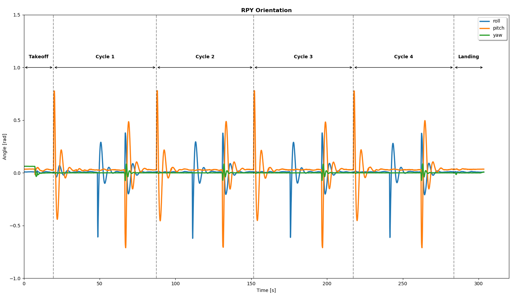

# Assignment 1 - Setup, Offboard Autonomy, & Plotting

The tools used for this assignment are:
    
* [jMAVSim](https://dev.px4.io/v1.9.0_noredirect/en/simulation/jmavsim.html), a simple multirotor/Quad simulator that allows you to fly copter type vehicles running PX4 around a simulated world.
* [QGroundControl](http://qgroundcontrol.com/), a ground control station (GCS) for UAVs that provides full flight control and mission planning for any MAVLink enabled drone.
* [mavros](http://wiki.ros.org/mavros), ROS package that provides communication driver for various autopilots with MAVLink communication protocol.

The assignment consists of creating a rosnode that commands the drone to takeoff at the way-point (0,0,10)- (X,Y,Z), then controls the drone to follow the trajectory way-points described bellow (repeat this for a total of 4 cycles), and finally land the drone:

1. Move forward 10 virtual meters.
2. Move up (heave) 15 virtual meters.
3. Move left 5 virtual meters.
4. Return to (0,0,10).

<p align="center">
  
</p>

To achive this the desired drone position is published to the rostopic `/mavros/setpoint_position/local/`. The final destionatipon is checked subscibing to the rostopic `mavros/local_position/pose` with a threshold of 0.05.

To plot the information from the trajectory of the drone the following rosbag command is executed in the terminal while the drone follows its trajectory:
```
rosbag record /mavros/path_cycle /mavros/local_position/pose
```
 The rostopic `/mavros/path_cycle` publishes a new custom rosmessage type, `cycle.msg`. This rosmessage contains the cycle count of the trajectory and the timestamp when each cycle starts.

Plots of the position (X,Y,Z) and orientation (Roll, Pitch, Yaw) of the drone with respect to time are given, as well as the 3D trajectory of the drone and the drone position in the planes (X, Y), (X,Z) and (Y,Z).

To visualize the plots from your home directory run:
```
cd ~/AerialRobotics/assignment1/src/offboard_UMD/script
python plot_position.py
```

<p align="center">

</p>

<p align="center">

</p>

<p align="center">

</p>

<p align="center">

</p>